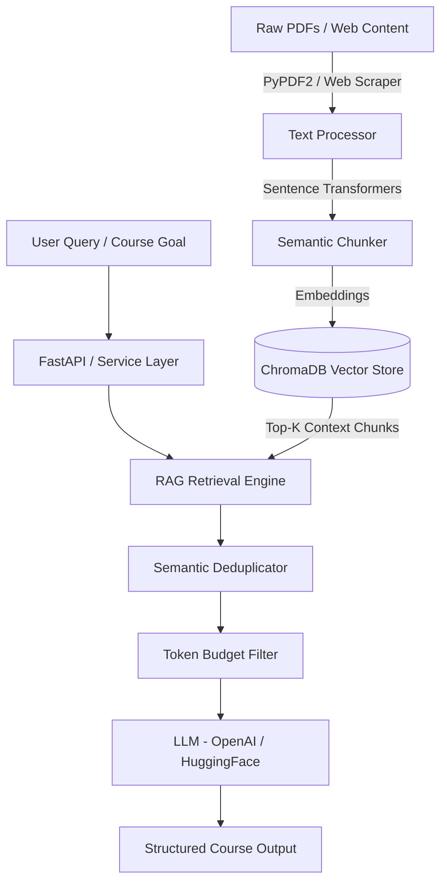

# 📚 RAG Course Generator

An intelligent, end-to-end **Retrieval-Augmented Generation (RAG)** system built with Python, LangChain, ChromaDB, DSPy, and FastAPI. It transforms raw documents (PDFs, web pages, plain text) into structured, high-quality educational courses, complete with modules, sub-modules, key takeaways, and concise summaries.

---

## Key Features

- **Semantic Document Chunking**: Segments unstructured PDFs and web text based on sentence embeddings and cosine similarity thresholds, outputting to `.txt`, `.json`, and `.csv`.
- **Multi-Source Ingestion**: Supports local PDF files, web scraping (`BeautifulSoup` + `Readability`), and Firecrawl scraper integrations.
- **Vector Database & Retrieval**: Fast, persistent embedding vector search using **ChromaDB** with optional Pinecone support.
- **Smart Context Filtering**:
  - **Semantic Deduplication**: Eliminates redundant content using embedding vector thresholding.
  - **Token Budgeting**: Dynamically constrains retrieved context based on target module reading/learning time.
  - **Coverage Control**: Supports `focused` and `broad` context retrieval strategies.
- **Flexible LLM Backend**: Configurable integration with **OpenAI** (GPT-4/GPT-3.5) and **HuggingFace Inference Endpoints**.
- **DSPy Optimization Pipeline**: Programs, signatures, and modules for programmatic prompt tuning and output optimization.
- **RESTful API**: Fast, async web endpoints powered by **FastAPI** with CORS support.
- **Production Ready**: Includes `Dockerfile` and `render.yaml` for containerized cloud deployment (Render, AWS, GCP, Azure).

---

## Architecture Overview



---

## Project Structure

```text
Rag-Course-Generator/
├── api/                        # FastAPI application & routes
│   ├── main.py                 # FastAPI application instance & CORS setup
│   └── routes.py               # API endpoints (/query, /index, /generate-course)
├── src/                        # Core application package
│   ├── chunker.py              # Semantic text chunking engine
│   ├── similarity_checker.py   # Sentence embedding similarity utilities
│   ├── text_processor.py       # Text cleaning & tokenization
│   ├── utils.py                # File saving utilities (.txt, .json, .csv)
│   ├── config/                 # Environment & prompt configuration
│   ├── dspy/                   # DSPy optimization modules & signatures
│   ├── embedding_store/        # Vector database connection & abstractions
│   ├── ingestion/              # Data loaders & ingestion pipelines
│   ├── model/                  # LangChain RAG pipeline & LLM connectors
│   └── service/                # Business logic for course generation
├── vector_store/               # ChromaDB index manager & query handlers
│   ├── chroma_client.py        # Persistent Chroma Client initialization
│   ├── index_documents.py      # Chunk indexing logic
│   └── query_documents.py      # Vector similarity query logic
├── scripts/                    # Test & debug execution scripts
├── data/                       # Input PDF storage
├── output/                     # Generated chunk files (.txt, .json, .csv)
├── run.py                      # Batch PDF chunking execution script
├── web_scraper.py              # Web scraping utility script
├── firecrawl_scraper.py        # Firecrawl integration script
├── Dockerfile                  # Container build specification
├── render.yaml                 # Render cloud deployment specification
└── requirements.txt            # Python dependencies specification
```

---

## Environment Configuration

Create a `.env` file in the project root directory with the following environment variables:

```env
# Core API Keys
HUGGINGFACE_API_KEY=your_huggingface_api_key_here
OPENAI_API_KEY=your_openai_api_key_here

# LLM Configuration
LLM_PROVIDER=openai  # Options: 'openai' or 'huggingface'
LLM_MODEL=gpt-4o-mini
TEMPERATURE=0.3
MAX_NEW_TOKENS=1024

# Vector DB & Embeddings
TOP_K=3
EMBEDDING_MODEL_NAME=sentence-transformers/all-MiniLM-L6-v2

# Debug Mode
DEBUG=false
```

---

## Quick Start

### 1. Prerequisites
- **Python 3.9+** installed on your system.
- Git installed.

### 2. Installation

1. **Clone the repository**:
   ```bash
   git clone https://github.com/suyashpjadhav/Rag-Course-Generator.git
   cd Rag-Course-Generator
   ```

2. **Create and activate a virtual environment**:
   ```bash
   # Windows (PowerShell)
   python -m venv .venv
   .\.venv\Scripts\Activate.ps1

   # Linux/macOS
   python3 -m venv .venv
   source .venv/bin/activate
   ```

3. **Install dependencies**:
   ```bash
   pip install -r requirements.txt
   ```

4. **Download NLTK tokenizers**:
   ```bash
   python -c "import nltk; nltk.download('punkt'); nltk.download('punkt_tab')"
   ```

---

## Running the Application

### Option A: Run Batch PDF Chunking

Place your `.pdf` files into the `data/` directory and execute:

```bash
python run.py
```

The chunked text outputs will be saved to the `output/` folder in `.txt`, `.json`, and `.csv` formats.

### Option B: Start the FastAPI Server

Start the interactive API server using Uvicorn:

```bash
uvicorn api.main:app --reload --host 0.0.0.0 --port 8000
```

Access the interactive API documentation (Swagger UI) at:
**`http://localhost:8000/docs`**

---

## API Endpoints Reference

### 1. Index a Document
- **Endpoint**: `POST /api/index`
- **Description**: Upload a chunked document file and index its vectors into ChromaDB.
- **Form Data**:
  - `file`: Document file (`.txt`)
  - `doc_id`: Unique identifier for the document

```bash
curl -X POST "http://localhost:8000/api/index" \
  -F "file=@output/sample_chunked.txt" \
  -F "doc_id=doc_101"
```

### 2. Search Similar Chunks
- **Endpoint**: `POST /api/query`
- **Description**: Perform a semantic vector search over indexed chunks.

```json
// Request Body
{
  "prompt": "What are the core concepts of Retrieval-Augmented Generation?",
  "top_k": 3
}
```

### 3. Generate Course Content
- **Endpoint**: `POST /api/generate-course`
- **Description**: Generates structured instructional course modules based on retrieved vector context.

```json
// Request Body
{
  "documents": ["doc_101"],
  "user_goal": "Master RAG Pipeline Architecture and Retrieval Systems",
  "level": "Intermediate",
  "duration": "2 Hours",
  "coverage_level": "focused"
}
```

```json
// Sample Response
{
  "status": "success",
  "content": "### Module 1: Introduction to Vector Search & Chunking\n\n#### Sub-module: Semantic Embeddings\n...\n"
}
```

---

## Testing & Debugging

Run test suites and debug scripts using Python's `unittest` module:

```bash
# Run unit tests
python -m unittest discover tests

# Test course service integration
python scripts/test_course_service.py
```

---

## Docker & Cloud Deployment

### Run with Docker

```bash
# Build Docker image
docker build -t rag-course-generator .

# Run Docker container
docker run -d -p 8000:8000 --env-file .env rag-course-generator
```

### Deploy on Render

This repository includes a pre-configured `render.yaml` specification for zero-config deployment on Render:

1. Connect your GitHub repository to Render.
2. Select **Blueprint** deployment.
3. Supply required environment variables (`OPENAI_API_KEY`, `HUGGINGFACE_API_KEY`) in the Render Dashboard.

---

## Contributing

Contributions are welcome! Please follow these steps:
1. Fork the project repository.
2. Create your feature branch (`git checkout -b feature/AmazingFeature`).
3. Commit your changes (`git commit -m 'Add some AmazingFeature'`).
4. Push to the branch (`git push origin feature/AmazingFeature`).
5. Open a Pull Request.
